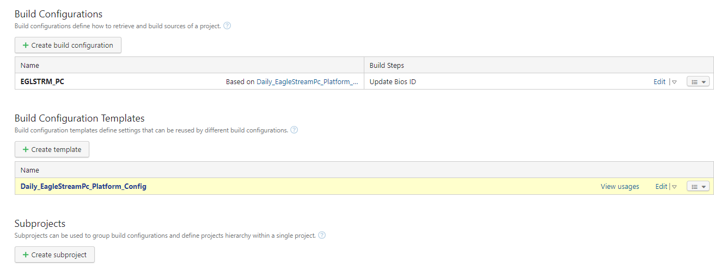
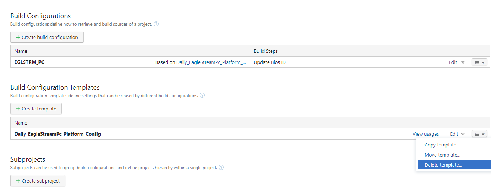
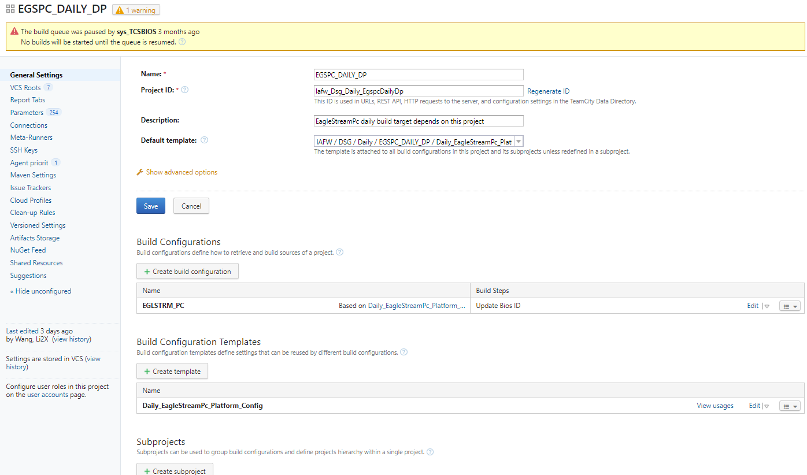
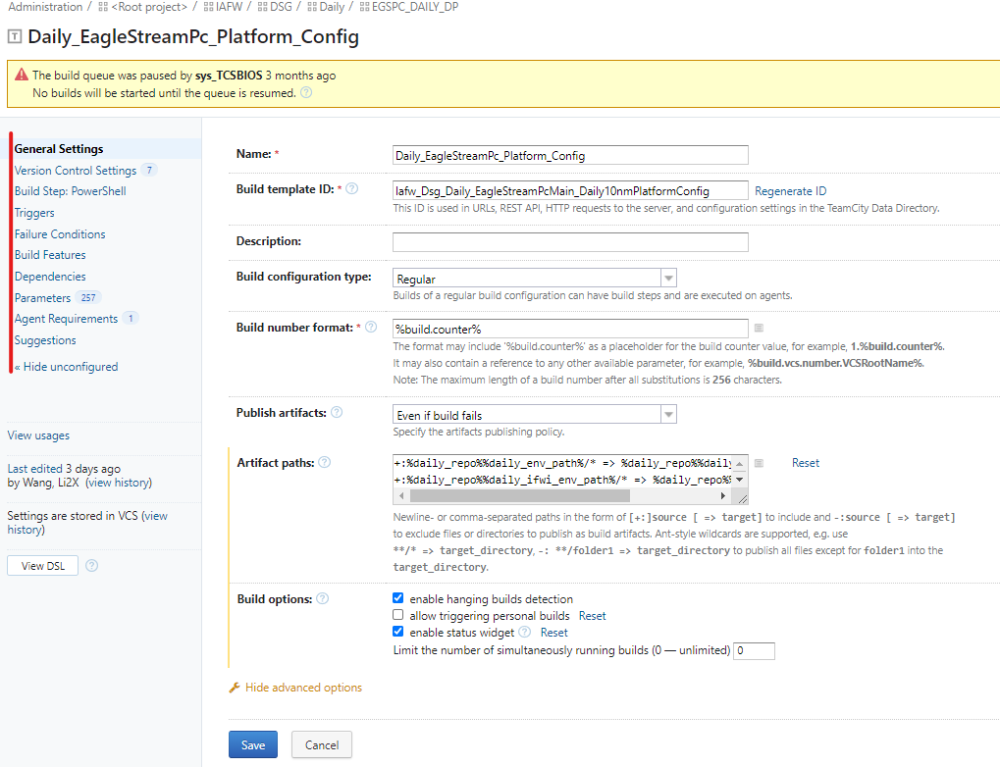
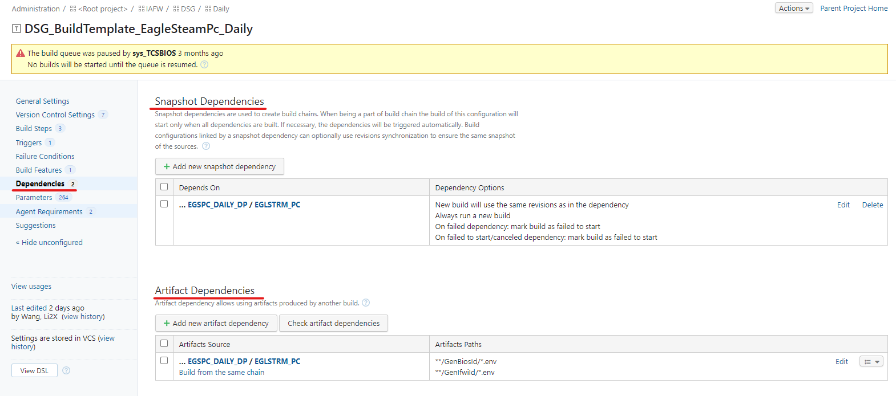
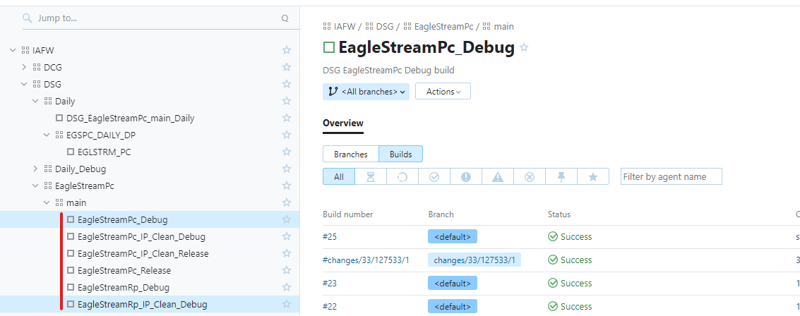
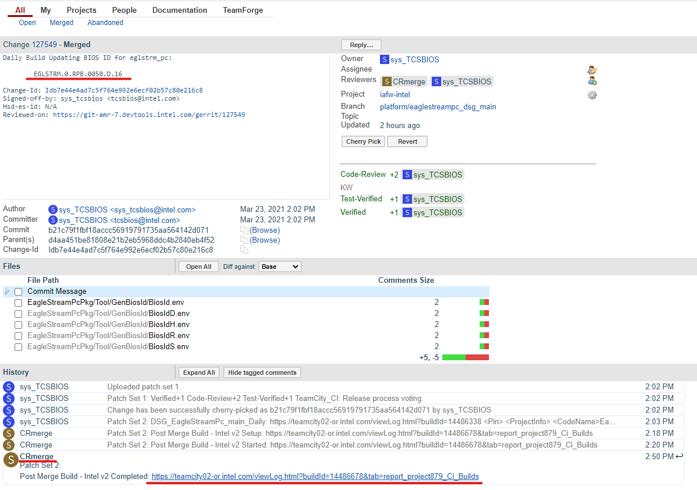

Daily settings
===================================
**Set Daily Release Build of BuildTarget**\
The Daily project is divided into dependent items and Daily Target. You can refer to the construction structure of
 other projects.\
Daily build pull the corresponding warehouse code at runtime, finds the files associated with the BIOS version. Then push and merge the changed BIOS version-related files, the commit message contains the BIOS version information.

The build target in the same branch automatically triggers the build when it is found to have a merge action and the
 commit message contains version information. At which point the build type is recognized as a daily and the result
  image is stored under the Artifactory nightly path.
  
(1) Dependency setting
-----------------------------------------------------------------
**a. Structure settings**\
Dependencies have a two-level structure. The first-level structure requires a Subproject to be created under Daily. 
The project name needs to follow certain naming conventions, which can be set according to the suggestions of colleagues
 in the CI department (or refer to other projects).
 
**b. Copy reference project**\
For the specific settings of dependencies, please refer to other projects, such as DCG-Daily-10nm_EGS_SPR_PO-EGSTRM_RP,
 find a similar project from other projects, copy to the newly created dependency project, find the corresponding 
 project first, and click Edit in the upper right corner Configuration Settings, dependent on the next level of the
  project.

Copy to project should select the newly created Daily dependency Subproject.

**c. Decoupling from the original project**\
Go back to the newly created dependency Subproject and check the project status. If there are redundant templates
 when copying over, you need to delete the redundant templates.
 
When deleting, also pay attention to whether the project in Build Configurations is based on this redundant project
. If there is Based on, you can change it and then delete it. If you want to disconnect from Based on, click detach to disconnect.

**d. Confirm the template used**\
Go back to Build Configuration Templates and click to delete the redundant template.\
If there are redundant templates, there is a manage behind Based on. After you click in manage and select the
 template you need, delete the redundant templates.
 
Click Build Configuration Templates to configure the General Settings, and you can fill in the parameters according
 to other project configurations.
 
 
**e. Configure specific parameters**\
After the Build Configuration Templates and Build Configurations structure are established, you can click to
 configure the project parameters.
  
Build Configuration Templates should be configured first, because Build Configurations is based on Build
 Configuration Templates, and each parameter of Build Configurations should also be configured in detail.
  
After the dependencies are configured, you can configure the Target item.

(2) Target settings:
----------------------------------

When setting the Target, you should also configure the Build Configuration Templates first. The parameter settings
 are similar to the previous configuration. You can copy the original build and change the parameters as needed. Need
  to pay attention to these two Triggers and Dependencies.
  
**a. Trigger settings**\
The trigger of the Daily build should be triggered at a specified fixed time point, pay attention to the time zone.
Triggers setting: Click Edit on the right to set the Trigger time according to the actual situation of the project.

**b. Dependencies settings**\
Dependencies in this item should select the previously established dependency project.
 
After the Templates are configured, configure the Build Configurations. In this item, you also need to pay attention
 to Triggers and Dependencies. The configuration is the same as Templates.
 
**c. Submit changes**\
Once all of Daily's project structures are configured, go to Jenkins to submit Therge Request and merge, and then go to TeamCity to run the manual Dailyrun build to see if the build works.

Daily build run mechanism, run daily build will call the dependency, after the results of the dependency run, Daily build continues to run and will get the BIOS version file push and merge, merge triggers other bugs.

Note that there is no image in Thely build, just a push and a file related to the BIOS version number, and you can see the comet message when the daily build push operation is done in the log:
 
 This information can be used to find the link that actually generated the image.
 
(3) View the daily running results
---------------------------------------------
To view the daily results, follow these steps:

**a. Determine the build of Daily**\
Find the corresponding Target on teamcity

**b. Find the BIOS ID**\
Click on the corresponding Build number, go in and check the Build log, in the third step (Step 3) of the Build log
, find the BIOS ID after update.

**c. Gerrit search**\
Copy this ID to <https://git-amr-7.devtools.intel.com/gerrit/>, you can enter it directly in the search box in the
 upper right corner to search.
 
 
**d. View the triggered daily build connection**\
After searching, click in, you can see the corresponding project, click the link under CRmerge, you can correspond
 to the corresponding project.
 
 
**e. Find the link of the image generated by the build**\
Click on the corresponding item to view the Build log. In the fifth step of the Build log, you can see the link to
 artifactory.
 
 
**f. Image artifactory link description**\
The download link of the image artifactory generated by the Daily build should be under <https://ubit-artifactory-or
.intel.com/artifactory/server-bios-staging-local/nightly/EGLSTRM>, which uses the BIOS version as the folder name, so
 that every day The generated BIOS will be in this directory, and testers can download and test according to the BIOS version under this link.\